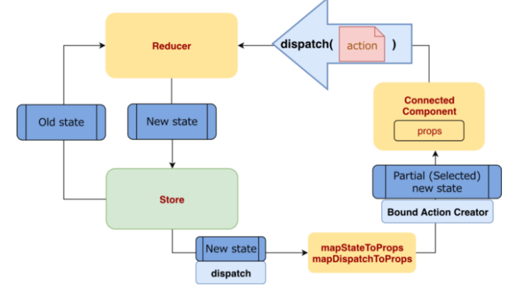

# Create React App 기반 React 정리

### React - HOOK, react-router-dom
**두 항목은 src/Class 폴더에 정리한다.**
1. Class-1. useState, useEffect, useContext
2. Class-2. useMemo, useRef, useCallback
3. Class-3. react-router-dom Hook 관련 정리
4. Class-4. react-router-dom Component와 Props를 정리한다.


### react-redux 
**Redux 폴더의 Pattern 폴더를 참고하도록 하자.**
1. [Pattern-1. Redux 기본 패턴](./src/Redux/Pattern_1)
2. [Pattern-2. Ducks 패턴](./src/Redux/Pattern_2)
3. Pattern-3. Redux-toolkit을 이용한 패턴

### Redux 키워드 숙지
[Redux 키워드 사이트](https://redux.js.org/tutorials/essentials/part-1-overview-concepts#terminology)

#### 액션 (Action)

Store에 변화가 필요할 때 Redux의 Action이 필요하다.
Action은 객체로 이루어져있으며 `type`은 필수 필드이다.
```javascript
    {
        type: 'DASHBOARD/INCREASE',/* 필수 */ 
        data : '@SOMETHING', /* 선택 */
    }
```

##### 액션 생성 함수
Action은 생성 함수는 Action을 좀더 쉽게 사용하기 위해 필요하며 해당 함수는 Action이 어떤 인자를 받아올 지 설정할 수 있다.
```javascript
    export const CREATEACTION = text => ({
        type: 'DASHBOARD/INCREASE', /* 필수 */
        text, /* 선택 */
    })
```
- - -
#### 리듀서 (Reducer)
Store에 변화를 발생시키는 함수, Store상태인 State와 action을 인자로 받는다.
`(state, action)=> newState`라고 생각하면 됨.
```javascript
    function reducer(state, action) {
        switch(action.type){
            case 'DASHBOARD/INCREASE':
                return state + 1;
            case 'DASHBOARD/DECREASE':
                return state - 1;
            default:
                return state;
        }
    }
```
- - -
#### 스토어 (Store)
리덕스에서는 한 애플리케이션당 하나의 스토어를 생성함. 스토어에는 현재 앱 상태, 리듀서 및 내장 함수가 들어있음.
- - -
#### 디스패치 (Dispatch)
Store 내장함수 중 하나로, Action을 발생 시키는 것 임. Dispath는 action을 파라미터로 전달하며
Store는 Reducer로 전달해서 `action.type`에 맞는 로직을 처리 해줌.
- - -
#### 구독 (Subscribe)

구독 또한 Store의 내장함수 중 하나이며 함수 형태의 값을 파라미터로 받아옴.
Action이 Dispatch 되었을 때 마다 전달해준 함수가 호출됨.
- - -

### 커넥트 (Connect)

Store의 내장함수로 mapStateToProps, mapDispatchToProps를 인자로 받아 호출하면 Wrapper Container를 인자로 받는 함수를 반환한다.   
해당 함수는 각각 State, Dispatch를 Wrapper Container로 넘어온 Component에 주입해준다.

### Redux의 3가지 Rule

#### 1. 하나의 App에 하나의 Store만 존재함.

여러 Store를 생성할 수 있으나 좋지 않은 방법임.   
Store를 여러개로 나누어야 하는 경우 CombineReducers를 사용하여 Store를 합치도록 하자.
#### 2. 상태는 읽기전용

원본을 건드리지 않고 수정을 해야함. `Immutable.js` 라이브러리 혹은 `스프레드 연산자`등 새로운 객체를 반환 하는 함수를 사용하여 작업해야함.
#### 3. 순수 함수만

Reducer함수가 받아온 state는 건들지 않고 새로운 state를 반환하고.   
똑같은 인자를 받은 함수는 늘 같은 결과값을 반환해야함.
- - -


#### react-redux 플로우 전체도.


- - -


 