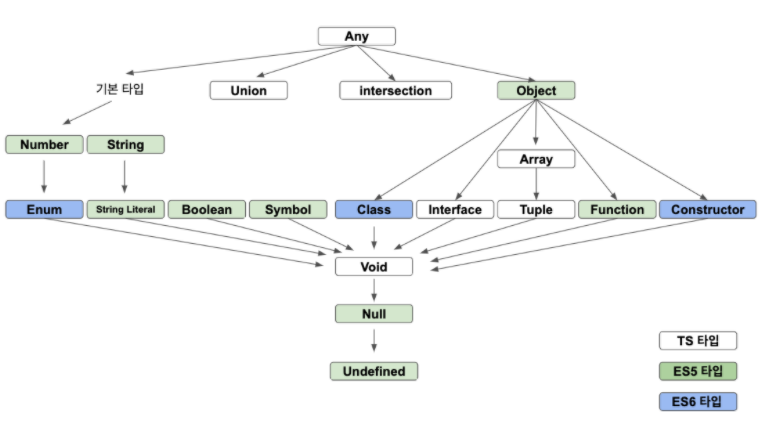

## 함수와 메서드

[메인 화면으로](../)

### 함수와 메서드의 차이
함수와 메서드를 수학적으로 보았을 때는 `함수`라는 동일한 키워드인 것 같다.  
하지만 함수는 `독립적`으로 존재하고 메서드는 `종속적`으로 존재한다는 큰 차이가있다.  
    

### 함수 선언문
**기본 함수 선언**  
```typescript
    function 함수이름(매개변수: 타입, 매개변수: 타입) : 반환 타입{
        /* content */
    }
```
**함수 시그니처**  
- 함수 시그니처 말은 어렵지만 단순히 `타입 요약본`정도로 생각해주면 될 것 같다.
```typescript
    /* 기본 구조 */
    (매개변수 타입[,...]) => 반환 타입
    /* example */
    /* 시그니처 사용 x */
    function printMe(name: string, age: number): void { }
    /* 시그니처 사용 ○ */
    let printMe: (string, number) => void  = function(name: string, age: number): void {}
```
**type 키워드로 타입 별칭 작성**  
```typescript
    /* 기본 구조 */
    type 새로운_타입 = 기존_타입
    /* example */
    type stringNumberFunc = (string, number) => void;
    let f: stringNumberFunc = function(a: string, b: number) : void {}
```
**undefined 관련 주의 사항**  
undefined는 하나의 타입으로 모든 타입의 최하위에 존재함  
따라서 undefined를 호출해도 상위 타입을 상속받는다고 간주하며 오류가 발생하지 않음.
이런 오류를 방지하기 위해 undefined인지를 판별하는 코드가 추가되어야 함.


```typescript
    /* error */
    interface INameable {
        name: string
    }
    function getName(o: INameable) { return o.name }

    /* 
        타입에서 걸려야하지만 자식 타입이라고 판단하며 받아드림.
        그리고 undefined.name 구문을 실행하기 때문에 에러 발생
    */
    let n = getName(undefined)
    /* errro fix */
    function getName(o: INameable) { return o === undefined ? 'unknown' : o.name }
    let n_fix = getName(undefined)
```
**선택적 매개변수**  
```typescript
    /* 기본구조 */
    function fn(arg1? : string) : void {}
    /* 시그니처 */
    type (string?) : void {}
```

### 함수 표현식
함수는 객체이다. 따라서 함수는 하나의 인스턴스로서 변수에 할당할 수있다.
**함수 표현식**  
```typescript
    const Add = function(a: number, b: number) : number { return a + b };
    Add(1, 2) // 3
```

**일등 함수란?**  
함수와 변수를 구분하지 않는다는 의미이다.  
일등 함수 기능을 제공하면 `함수형 프로그래밍 언어`라고 한다.

**계산법**  
컴파일러는 표현식을 만나면 계산법을 적용한다.  
계산법에는 두가지 방법이 있으며 `eager evaluation(조급한 계산)`, `lazy evaluation(느긋한 계산)`로 구분할 수 있다.  
컴파일 중 `1 + 2`를 만나면 `eager evaluation`로 적용하고 `function(a, b){return a + b}`를 만나면  
`lazy evaluation`를 적용하여 우선 계산을 보류한다.

**익명 함수**  
```typescript
    /* 
        함수를 감싸주는 이유는 연산자 우선 순위를 먼저 진행하기 위함이다. 
        ex) (1 + 2) * 3 에서 1 + 2를 감싸줘 연산자의 우선 순위를 정하는 원리.
    */
    let value = (function(a, b){ return a + b})(1, 2) //3
```
### 화살표 함수와 표현식 문

**기본 구조**  
```typescript
    /* 기본 구조 */
    const 함수이름 = (매개변수: 타입[,...]) : 반환타입 => 함수몸통
    /* example */
    const arrow1 = (a: number, b: number): number => { return a + b } //실행문 방식 몸통
    const arrow2 = (a: number, b: number): number => a + b //표현식 문 방식 몸통
```

**실행문과 표현식 문**  
실행문은 CPU에서 실행되는 코드이며 `return`을 해야만 결과를 알려주는 구문이다.  
표현식 문은 굳이 `return`을 하지 않아도 결과를 알려주는 구문이다.
표현식 문은 변수에 할당받을 수 있는 코드 단위이기도 하다.
```typescript
    /* easy example */
    let x // 실행문
    x = 1 //표현식 문
    let x = let y // 실행문을 할당하려면 에러가 발생.
    //만약 표현식 구문이 없다면 모든 CPU계산에 return이 필요하다
    if((return x > y)) // 얼마나 코드 짜기가 싫어졌을까..
    // 표현식
    if(x > y) // 깔끔한 표현식 코드..
```

**실행문을 만드는 세미콜론**  
타입스크립트에서는 관습적으로 표현식 문에는 세미콜론을 붙이지 않습니다.

### 일등 함수

**콜백 함수**  
매개변수 형태로 동작하는 함수를 `콜백 함수`라고 함.
```typescript
    /* exmple */
    export const init(callback: () => void): void => {
        callback();
    };
    init(()=> console.log('----'));
```
**중첩 함수**  
함수 안에 함수를 중첩해서 구현
```typescript
    //calc함수는 add, multiply라는 이름의 중첩 함수를 구현하고 있음.
    const calc = (value: number, cb: (number)=> void): void => {
        let add = (a, b) => a + b //표현식 문
        function multiply(a, b){ return a * b} //실행문

        let result = multiply(add(1, 2), value);
        cb(result);
    }
    calc(30, (result: number)=> console.log(`result is ${result}!!`)); // result is 90!!
```

### 고차 함수와 클로저 & 부분함수

**고차 함수**  
선언된 함수가 또 다른 함수를 반환하는 함수
```typescript
    const add1 = (a: number, b: number): number => a + b // 보통 함수
    const add2 = (a: number): number => (b: number) : number => a + b // 고차 함수
    add2(1)(2) // 3
    // add2에서 Arrow Func를 걷어내자
    const add2 = function(a: number) : (number) => number {
        //함수 1) 반환 타입으로 number매개변수와 number를 return 하는 함수를 받는다.
        return function(b: number) : number {
            //함수 2) 반환 타입으로 number를 갖는다.
            /* a는 함수 내부에 선언되지는 않았지만 사용할 수 있다. 이것을 클로저라 한다. */
            /* 클로저 : 스코프 내에 변수가 없을 때 스코프 체인으로 연결된 상위 스코프를 참조. */
            return a + b;
        }
    }
```
**부분 함수**  
고차 함수가 완벽하게 끝나지 않은 상태를 부분 함수라고 한다.
```typescript
    const multiple = a => b => c => a * b * c
    let multiple_middle = multiple(1)(2); // 부분함수
    multiple_middl(3); // 6
```

### 함수 구현 기법

**매개변수 기본값**  
```typescript
    (매개변수: 타입 [= 매개변수 기본값], [...]) : 반환_타입
```

**객체를 반환하는 화살표함수**  
```typescript
    /* 복합 실행 구문 함수로 판단하여 객체가 반환되지 않음 */
    const makePerson(name: string, age: number =10): {name: string, age: number} => {name, age}
    /* 소괄호로 감싸주어야 표현문으로 판단함. */
    const makePerson(name: string, age: number =10): {name: string, age: number} => ({name, age})    
```

**매개변수에 비구조화 할당**  
```typescript
    type Person = {
        name: string,
        age : number
    }
    const printPerson = ({name, age}: Person): void => console.log(`name : ${name}, age : ${age}`)
    printPerson({name:'Jack', age: 23});
```
**색인 키와 값으로 객체 만들기**  
```typescript
    /* 색인 기능 타입 지정하기 */
    type KeyType = {
        [key: string]: string
    }
    /* 색인 기능 타입 만들기 */
    const makeObject = (key: string, value: string): KeyType => ({[key]: value})
```

### 클래스 메서드

**function 함수와 this**  
function 함수는 this키워드를 사용할 수 있다.  
Arrow Function는 this를 사용할 수 없다.  
여기서 사용할 수 있다 없다의 의미는 `this`를 바인딩 할 수 있느냐 없느냐의 차이다.  
Arrow Function의 this는 정적으로 `상위 스코프의 this`를 바라본다.  
function으로 생성된 함수는 동적으로 작동하기 때문에 `bind, apply, call` 및 호출 지점에서 결정된다.
```typescript
    const Fna = function(){console.log(this)};
    const Fnb = () => console.log(this);
    const obj = {"name":"lee"}
    Fna.call(obj) // {"name":"lee"}
    Fnb.call(obj) // window객체
```

**기본 메서드**  
```typescript
    export class A {
        constructor(public value: number =1 ){}
        method(): void {
            console.log(`value: ${this.value}`)
        }
        /* 
            위의 표현과 동일하다.
            method: () => void = function(): void {
                console.log(`value: ${this.value}`)
            }
         */
    }
    let a : A = new A(2);
    a.method() // value : 2
```
**정적 메서드**  
```typescript
    export class A {
        static method(): string {
            console.log(`I'm Class A`)
        }
        
    }
    A.method() // I'm Class A
```

**메서드 체인**  
메서드를 이어서 계속 호출하는 방식
```typescript
    export class Calculator {
        constructor(public value: number = 0){}
        add(value: number) {
            this.value += value;
            return this;
        }
        multiply(value: number) {
            this.value *= value;
            return this;
        }
    }

    let calc = new Calculator();
    let result = calc.add(1).add(2).multiply(2).value;
    result // 6 ( (0 + 1 + 2) * 2 )
```
