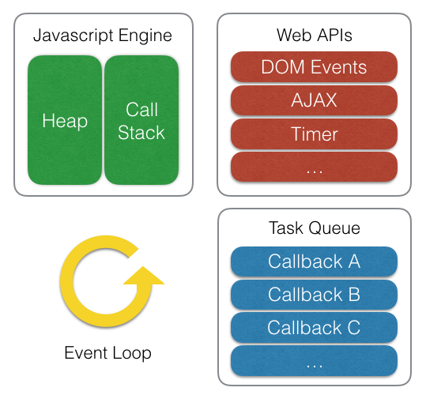

# 자바스크립트 동작 원리

Created: 2022년 2월 11일 오후 3:34
Last Edited Time: 2022년 2월 11일 오후 5:54
Type: 개발 개념

### 자바스크립트 동작 원리

자바스크립트는 프론트 구성에 있어 대체 불가능한 언어이다. 따라서 반드시 프론트 개발자라면 동작원리를 이해하고 있어야 고급 프론트 개발자가 될 수 있다고 생각한다. 자바스크립트 엔진은 구글에서 개발한 **V8**, 모질라 재단에서 운용하는 **Rhino** 등 다양한 엔진이 있으나 **Node**와 **chrome**에서 사용하고 있는 **V8** 엔진 기준으로 동작 원리를 작성하겠습니다.

### 자바스크립트 엔진 구성도

자바스크립트 엔진 구성 요소는 아래와 같습니다.

- Memory Heap ( 변수 메모리 관리 )
- Call Stack ( 일감이 쌓이는 곳 )
- Web API ( webGL, setTimeOut 등을  지원 )
- Task queue ( webAPI에서 종료된 작업이 쌓이는 곳 )
- Microtask queue ( Task Queue와 하는 일은 비슷하나 우선 순위가 높음 )
- event loop ( callStack을 주시하고 있다가 callStack이 비었을 때 Task Queue의 작업을 푸시 해줌 )

정확하게 위의 요소를 분리하면 아래의 그림과 같습니다.



위 그림에서 확인할 수 있듯이 자바스크립트 엔진에서 제공하는 것은 Heap과 Call Stack, 브라우저에서 제공해주는 Web API 그리고 동시성을 제어하기 위한 Event Loop와 Task Queue가 JS를 실행시키기 위한 하나의 묶음으로 제공됩니다.

### 자바스크립트 CallStack 처리 흐름

우선 event loop과 webAPI를 제외하고 CallStack이 어떻게 일감을 처리하는 지 확인해보겠습니다.

CallStack은 실행 가능한 코드 기준으로 일감이 쌓이며 해당 일감은 **LIFO(Last In First Out)** 알고리즘으로 처리됩니다. 함수의 경우 실행된 함수 스코프 안에 실행 가능한 코드가 전부 수행 및 완료되기 전 까지 일감으로 존재합니다.

```jsx
function multiply(x, y) {
    return x * y;
}
function printSquare(x) {
    var s = multiply(x, x);
    console.log(s);
}
printSquare(5);
```

위의 코드는 아래와 같은 흐름으로 실행됩니다.


1. 가장 먼저 printSquare가 실행됩니다. ( printSquare 실행 컨텍스트 생성 )
2. 함수 내부의 multiply 함수가 실행됨 ( multiply 실행 컨텍스트 생성 )
3. multiply 함수 내부의 실행 가능 코드 (x * x)가 수행 및 완료되며 multiply 일감을 callStack에서 삭제 (multiply 실행 컨텍스트 영역도 메모리 해제)
4. printSquare 함수 내부의 console.log 코드가 수행 및 완료되며 printSquare 일감을 callStack에서 삭제 (printSquare 실행 컨텍스트 영역도 메모리 해제)
5. 🎇완료 🎇

<aside>
❓ 실행 컨텍스트는 JS 동작에 있어 많은 핵심 개념 ( scope, hoisting, this 등) 동작원리를 담고 있는 핵심 동작 원리입니다. 해당 내용은 추후 다루어 보도록 하겠습니다.

</aside>

### ☠Emergency☠ CallStack 폭파!

callStack은 무한대가 아니기 때문에 stack에 종료되지 않는 일감이 계속 쌓이게 될 경우 최대 사이즈가 넘어 에러가 날 수 있습니다. 우리는 종료되지 않는 재귀 함수 호출로 쉽게 콜 스택의 존재를 확인할 수 있습니다.

```jsx
function a() {
    a()
}
a()
```


### 동시성 처리를 포함한 CallStack

자바스크립트는 단일 스레드를 이용한 엔진으로 하나의 콜스택을 가지고 있기 때문에 조금은 특이한 방식으로 동시성 제어를 지원합니다. 아래의 코드와 이미지로 해당 프로세스에 대해 알아보겠습니다.

```jsx
function a() {
	setTimeout(() => {
		console.log('a')
	}, 1000)
	console.log('b')
}
// 'b'
// 'a'
```

위의 코드는 b ⇒ a 순으로 출력될 것입니다.  분명 단일 스레드로 진행하는데 어떻게 b가 출력되고 a가 출력될 수 있을까요? JS엔진은 이것을 WebAPI와 Task Queue로 해결합니다.


1. 함수 a가 되어 Call Stack에 일감으로 등록됩니다.
2. 함수 내부의 setTimeout이 일감으로 등록되고 실행되며 setTimeout은 webAPI로 권한을 넘기고 종료됩니다.
3. 다음 console.log가 일감으로 등록되며 실행됩니다.
4. a 함수 실행 컨텍스트 내부에서 모든 실행 가능한 코드가 수행 및 완료되었기 때문에 a 함수도 Call Stack에서 삭제됩니다.
5. webAPI가 완료된 callback 함수를 TaskQueue에 삽입합니다.
6. 이벤트 루프는 Call Stack이 모두 비었음을 확인한 후 Task Queue에 있는 일감을 Call Stack에 삽입합니다.

### setTimeout(() ⇒ {}, 0) ?!

자바스크립트 코드를 분석하다보면 `setTimeout(function, 0)` 이라고 작성되어있는 코드를 종종 볼 수 있습니다. setTimeout이 0이면 분명 바로 실행될 것인데 도대체 왜...? 라는 질문을 저도 주니어 개발자 일 때 했었는데요. 본론으로 들어가면 위의 코드는 **Event Loop**의 특성을 이용한 프로세스로 Call Stack이 비어있을 때 까지 실행되지 않았으면 하는 코드를 작성할 때 사용될 수 있는 코드입니다. 아래 코드 예시를 참고하여 설명 이어가도록 하겠습니다.

```jsx
function a() {
    let b = 1;
	setTimeout(() => {
		console.log(`setTimeout -> ${b}`)
	}, 0)
	for(let i = 0; i < 10; i++) {
        b += i
        console.log(b)
    }
    return 'end'
}
```

위의 코드의 결과는 아래와 같습니다.


1. a 함수가 실행되고 곧바로 setTimeout 함수가 실행됩니다. 
2. setTimetout 함수는 실행되어 webAPI로 권한을 옮기고 webAPI는 곧바로 Task Queue에 callback을 삽입합니다.
3. EventLoop가 Call Stack을 확인하였습니다. 하지만 이미 Call Stack에는 일감이 많이 등록되어 있어 해당 일감이 모두 비워질 때 까지 기다립니다.
4. a 함수가 종료되고 Call Stack의 모든 일감이 지워졌을 때 비로소 Task Queue에 있는 일감을 Event Loop가 Call Stack으로 삽입합니다.

